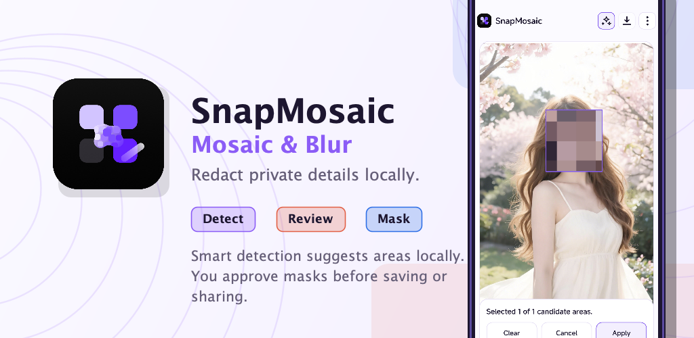

  

# SnapMosaic

SnapMosaic is a local-first Android image privacy editor for quick masking before you save or share a photo.

Use mosaic, blur, or solid block effects to cover sensitive areas such as faces, names, addresses, IDs, license plates, receipts, screenshots, and other private details. SnapMosaic does not require an account, and selected image content is processed locally by default.

## Official Links

- Website: <https://magic-xu.github.io/mosaic-legal/>
- Google Play: <https://play.google.com/store/apps/details?id=com.magic.snapmosaic>
- X / Twitter: <https://x.com/snapmosaic_app>
- Privacy Policy: <https://magic-xu.github.io/mosaic-legal/privacy.html>
- Terms of Service: <https://magic-xu.github.io/mosaic-legal/terms.html>
- 中文站点: <https://magic-xu.github.io/mosaic-legal/zh-CN/>
- 中文隐私政策: <https://magic-xu.github.io/mosaic-legal/zh-CN/privacy.html>
- 中文服务条款: <https://magic-xu.github.io/mosaic-legal/zh-CN/terms.html>
- Support: <snapmosaic.help@outlook.com>

## What SnapMosaic Does

- Applies mosaic, blur, and block masking to selected image areas.
- Supports brush, rectangle, and circle selection modes.
- Lets users adjust effect strength and tool size.
- Supports undo, redo, local save, and Android system share.
- Offers privacy-oriented export behavior, including optional metadata removal when saving.

## Repository Scope

This repository hosts the public SnapMosaic website and legal pages through GitHub Pages. It is intended for:

- Social profile links and public product introduction.
- App store website and privacy policy fields.
- In-app settings links for privacy, terms, support, and feedback.
- Versioned public references for privacy and terms updates.

The GitHub Pages source is the repository root on the `main` branch.

## Assets

Public website assets live in `assets/`:

- `assets/snapmosaic-play-icon-512.png`
- `assets/snapmosaic-feature-graphic-1024x500.png`
- `assets/screenshots/*.png` for current ASO preview images
- `assets/screenshots/*.jpg` for archived raw app screenshots

## Maintenance Notes

- Keep English and zh-CN pages consistent in meaning.
- Update the effective date in both languages when legal content changes.
- Use `https://magic-xu.github.io/mosaic-legal/privacy.html` as the English privacy policy URL for app store forms.
- Use `https://magic-xu.github.io/mosaic-legal/` as the public website URL for social profiles.

## 中文说明

SnapMosaic 是一款本地优先的 Android 图片隐私处理工具，用于在保存或分享照片前快速隐藏敏感区域。

这个仓库用于托管 SnapMosaic 的公开官网、隐私政策和服务条款。推特、应用商店和 App 内设置页建议使用 GitHub Pages 地址，而不是 GitHub 仓库地址。
